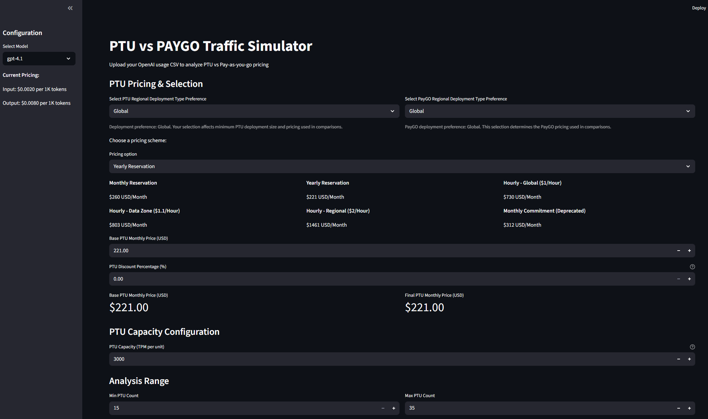
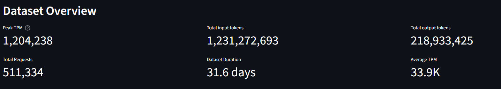
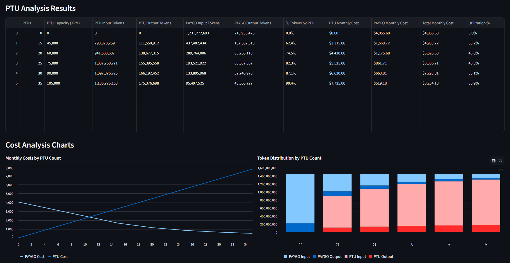
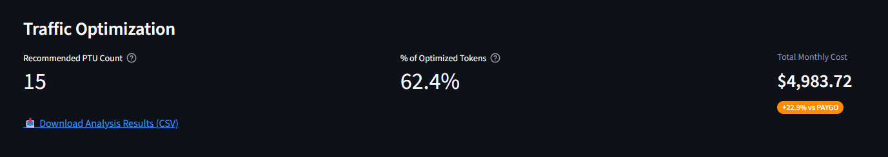

# 🚀 PTU vs PAYGO Traffic Simulator

**A comprehensive OpenAI cost analysis tool for comparing Provisioned Throughput Units (PTU) vs Pay-as-you-go (PAYGO) pricing**

[](https://www.python.org/)
[](https://streamlit.io/)
[](LICENSE)

---

## 📊 Overview

The PTU vs PAYGO Traffic Simulator helps you make data-driven decisions about OpenAI pricing models by analyzing your actual usage patterns. Upload your OpenAI usage CSV and get detailed insights into:

- **Cost Analysis**: Compare PTU vs PAYGO pricing across different configurations
- **Traffic Optimization**: Find the optimal PTU count for your workload patterns  
- **Token Distribution**: Understand how your tokens would be allocated between PTU and PAYGO
- **Utilization Metrics**: Analyze PTU capacity utilization over time

## ✨ Key Features

### 🎯 **Smart Configuration**
- **6 PTU Pricing Schemes**: Monthly/Yearly Reservation, Hourly Global/Data Zone/Regional, Monthly Commitment
- **Flexible Discount Support**: Apply custom discount percentages to PTU pricing
- **Model Selection**: Pre-configured for GPT-4.1 with 3,000 TPM capacity
- **Regional Deployment Options**: Compare Global vs Regional pricing

### 📈 **Advanced Analytics**
- **Per-minute Utilization**: More accurate than peak-based calculations
- **Token Weighting**: Accounts for input/output token pricing ratios (e.g., 1:4 for PTU capacity)
- **Spillover Analysis**: Shows how excess tokens flow to PAYGO when PTU capacity is exceeded
- **Cost Projection**: Annualize costs based on dataset duration

### 🎨 **Interactive Visualizations**
- **Real-time Cost Charts**: Compare PTU vs PAYGO costs across configurations
- **Token Distribution Charts**: Visualize how tokens are handled by each pricing model
- **Traffic Optimization Insights**: Get recommendations with color-coded cost indicators

### 📊 **Comprehensive Reporting**
- **Detailed Results Table**: US-formatted numbers with comma separators
- **Traffic Optimization Metrics**: Shows percentage of tokens optimized by PTU
- **CSV Export**: Download complete analysis results
- **Performance Metrics**: Dataset overview with peak/average TPM statistics

---

## 🚀 Quick Start

### Prerequisites
- Python 3.12+
- OpenAI usage CSV file with columns: `timestamp`, `input tokens`, `output tokens`

### Installation

1. **Clone the repository**
   ```bash
   git clone https://github.com/karpikpl/PTU-PAYGO-OpenAI-Simulator.git
   cd PTU-PAYGO-OpenAI-Simulator
   ```

2. **Install dependencies** (using uv - recommended)
   ```bash
   uv sync
   ```

3. **Run the application**
   ```bash
   uv run streamlit run app.py
   ```

4. **Open your browser** to `http://localhost:8501`

---

## 📸 Screenshots

### 🏠 Main Dashboard

*Configure PTU pricing, model selection, and upload your usage data*

### 📊 Dataset Overview

*Analyze your token usage patterns with key metrics and statistics*

### 📈 PTU Analysis Results

*Comprehensive comparison table with formatted numbers and percentage breakdowns*

### 🎯 Traffic Optimization

*Smart recommendations with color-coded cost indicators (🟠 more expensive, 🟢 cost savings)*

### 📉 Cost Analysis Charts

*Interactive visualizations showing cost trends and token distribution*

---

## 🔧 Usage Guide

### 1. **Configure Pricing**
- Select your preferred PTU pricing scheme (Monthly/Yearly/Hourly)
- Choose deployment preference (Global vs Regional)
- Apply any discounts you've negotiated
- Set PTU capacity (default: 3,000 TPM for GPT-4.1)

### 2. **Upload Usage Data**
Your CSV should include these columns (case-insensitive):
- `timestamp [UTC]` - Request timestamp
- `input tokens` - Number of input tokens
- `output tokens` - Number of output tokens
- `total tokens` - Total tokens (optional, will be calculated)

### 3. **Analyze Results**
- **Dataset Overview**: Review your usage patterns and peak metrics
- **PTU Analysis**: Examine cost breakdowns across different PTU configurations
- **Traffic Optimization**: Get recommendations for optimal PTU count
- **Export Results**: Download detailed analysis as CSV

---

## 🏗️ Architecture

### Modular Design
```
├── app.py                 # Main Streamlit application
├── data_processing.py     # CSV processing and data preparation
├── ptu_calculations.py    # PTU simulation and cost calculations
├── pricing.py             # Model pricing and configuration
└── utils.py              # Utility functions and formatting
```

### Key Algorithms

#### **PTU Simulation Engine**
- **Per-request Processing**: Simulates token allocation request by request
- **Minute-based Capacity**: Resets PTU capacity every minute (realistic behavior)
- **Proportional Spillover**: Maintains input/output ratios when PTU capacity is partially used
- **Output Token Weighting**: Accounts for different pricing weights (e.g., output tokens = 4x input tokens in PTU capacity)

#### **Cost Calculation**
- **Annualized Projections**: Scales costs based on dataset duration
- **Blended Pricing**: Combines PTU fixed costs with PAYGO variable costs
- **Regional Pricing Support**: Handles different pricing tiers and deployment options

---

## 🔬 Technical Details

### **Utilization Calculation**
The simulator uses **per-minute average utilization** rather than peak-based calculations:

```python
minute_utilizations = (tokens_per_minute / ptu_capacity_tpm * 100).clip(0, 100)
utilization_pct = minute_utilizations.mean()
```

This provides more accurate utilization metrics because PTU offers constant TPM capacity, and any minute with usage below capacity represents underutilization.

### **Token Weighting**
Different token types have different costs in PTU capacity:

```python
# Example: Input $0.002, Output $0.008 per 1K tokens
output_weight = output_price / input_price  # 4.0
request_ptu_demand = input_tokens + (output_tokens * output_weight)
```

### **Traffic Optimization Logic**
Finds PTU configurations closest to PAYGO cost (typically slightly more expensive) for balanced traffic optimization:

```python
# Prefer configurations slightly above PAYGO cost
above_paygo = configs[configs['cost_diff'] >= 0]
optimal_config = above_paygo.loc[above_paygo['cost_diff'].idxmin()]
```

---

## 🤝 Contributing

We welcome contributions! Please see our [Contributing Guidelines](CONTRIBUTING.md) for details.

### Development Setup
```bash
# Clone and install in development mode
git clone https://github.com/karpikpl/PTU-PAYGO-OpenAI-Simulator.git
cd PTU-PAYGO-OpenAI-Simulator
uv sync --dev

# Run tests
uv run pytest

# Format code
uv run black .
uv run isort .
```

---

## 📝 License

This project is licensed under the MIT License - see the [LICENSE](LICENSE) file for details.

---

## 🙏 Acknowledgments

- **OpenAI** for the PTU and PAYGO pricing models
- **Streamlit** for the excellent web framework
- **Pandas** for data processing capabilities

---

## 📞 Support

- 🐛 **Issues**: [GitHub Issues](https://github.com/karpikpl/PTU-PAYGO-OpenAI-Simulator/issues)
- 💬 **Discussions**: [GitHub Discussions](https://github.com/karpikpl/PTU-PAYGO-OpenAI-Simulator/discussions)

---

<div align="center">
  <strong>Made with ❤️ for the OpenAI community</strong>
  <br>
  <em>Optimize your AI costs with data-driven insights</em>
</div>
